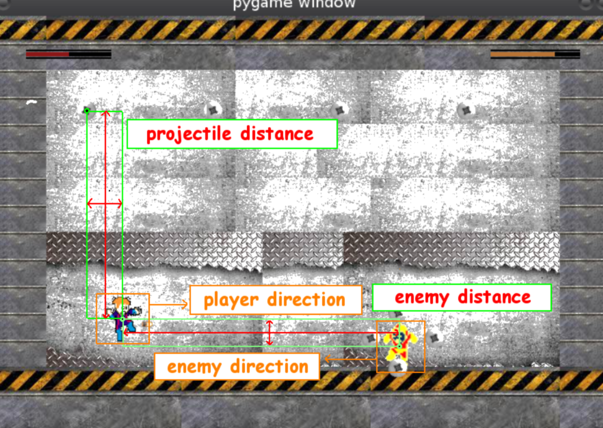

# 🧬 Evolutionary EvoMan player - Assignment 1 🎮

This repository contains a project realized as part of the *Evolutionary Computing* course of the Master's degree in Artificial Intelligence, Vrije Universiteit Amsterdam.     
The aim of this project is compare two **Evolutionary Algorithms** for the task of video game playing using a python framework called EvoMan.
For more details, read the [task assigment](standard_assignment_taskI.pdf).
The proposed solution is describer in the [report](report/report.pdf).

### Approach 1

For the first part of the experiment, meaning the evolution part, you need to:
- Run the `approach1/genetic_optimization.py` file. There you can set up the ENEMY global variable to change through different enemies. 
- The best individual found  is stored in the `approach1/runs/enemy_#/best_individual_run_#.txt` file. The history of the evolution is stored in the `approach1/runs/enemy_#/logbook_run_#.csv` file.
- The `hyperparameter_tuning.py` file is used to tune the hyperparameters of the algorithm through hyperopt 
- `approach1/experiment_runner.py` runs 10 optimizations simultaneously.
  
For the second part, where the best individuals are confronted to different enemies, you need to:
- Run the `approach1/play_with_best.py` file, selecting the enemy you want to play with. 
- Results are then stored in the `approach1/runs/enemy_#/games_played.csv` file.

### Approach 2

For the first part of the experiment, meaning the evolution part, you need to:
- Run the `approach2/neat_optmization.py` file. There you can set up the ENEMIES global variable to change through different enemies.
- The best individual found  is stored in the `approach2/runs/enemy_#/best_individual_run_#.txt` file. The history of the evolution is stored in the `approach2/runs/enemy_#/logbook_run_#.csv` file.

For the second part, where the best individuals are confronted to different enemies, you need to: 
- Run the `approach2/play_with_best.py` file. There can change the ENEMY parameter to face different enemies (those enemies need to have a created folder and results from the first part of the experiment) 
- Results are stored in the `approach2/runs/enemy_#/games_played.csv` file.

### Results
Results obtained with both approach show that even in the early generations we can obtain very good individuals, reaching fitness  values above 90 for all three enemies tested.
To have a deeper insight on the graphs, check out the `plots` folder.

## Group members - 88

|  Name     |  Surname  |     Email                              |    Username      |
| :-------: | :-------: | :------------------------------------: | :--------------: |
| Simone  | Montali     | `s.montali@student.vu.nl`       | [_montali_](https://github.com/montali)         |
| Giuseppe  | Murro     | `g.murro@student.vu.nl`       | [_gmurro_](https://github.com/gmurro)         |
| Nedim | Azar | `n.azar@student.vu.nl` | [_nedimazar_](https://github.com/nedimazar) |
| Martin | Pucheu  Avilés    | `m.i.pucheuaviles@student.vu.nl`      | [_martinpucheuaviles_](https://github.com/martinpucheuaviles) |

## License

This project is licensed under the GNU General Public Licens - see the [LICENSE](LICENSE) file for details
